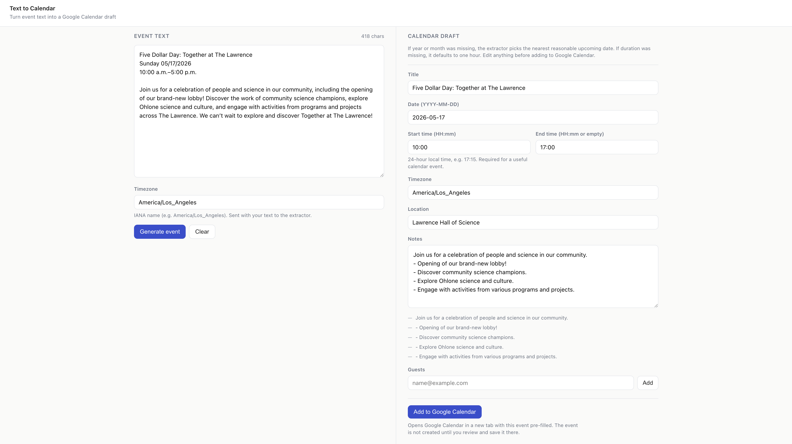

# Text2Calendar



Text2Calendar is an MVP web app that turns unstructured event text into an
editable calendar draft, then opens a pre-filled Google Calendar event.

Paste event details from an email, message, flyer, newsletter, or webpage. The
app extracts the title, date, time, location, notes, timezone, and guests, lets
you review everything, and then hands off to Google Calendar for final saving.

[https://text2calendar.tinyworks.dev](https://text2calendar.tinyworks.dev/)

## Features

- Paste natural-language event text.
- Extract structured calendar event fields with an LLM.
- Preview and edit the generated event before opening a calendar link.
- Add guest emails with client-side validation.
- Open a pre-filled Google Calendar event URL.
- Keep provider API keys on the backend only.

## Tech Stack

- Frontend: React, JavaScript, Vite
- Backend: Flask, Python
- Validation: JSON Schema, Ajv, jsonschema
- Calendar handoff: Google Calendar URL

## Project Structure

```text
backend/   Flask API for event extraction
frontend/  React + Vite single-page app
shared/    Shared JSON schemas
docs/      Product and technical docs
```

## Prerequisites

- Node.js and npm
- Python 3
- An API key for live extraction

## Backend Setup

```bash
cd backend
python3 -m venv .venv
source .venv/bin/activate
pip install -r requirements.txt
cp .env.example .env
```

Set `LLM_API_KEY` in `backend/.env` for live LLM calls.

Optional backend environment variables:

- `LLM_API_BASE`: defaults to `https://api.openai.com/v1`
- `LLM_MODEL`: defaults to `gpt-4o-mini`
- `PORT`: defaults to `5001`

Run the backend:

```bash
cd backend
source .venv/bin/activate
python app.py
```

The API runs at `http://127.0.0.1:5001`.

## Frontend Setup

```bash
cd frontend
npm install
npm run dev
```

The frontend runs at `http://localhost:5173` and proxies `/api/*` to
`http://127.0.0.1:5001`.

## Testing

Backend:

```bash
cd backend
source .venv/bin/activate
pytest
```

Frontend:

```bash
cd frontend
npm test
```


## API

- `GET /api/health`: returns `{ "status": "ok" }`
- `POST /api/extract-event`: accepts event text and context, then returns an
  editable event draft

Example request body:

```json
{
  "text": "Dinner at 6pm Friday at House of Nanking",
  "timezone": "America/Los_Angeles",
  "currentDate": "2026-05-13",
  "currentTime": "23:20",
  "locale": "en-US"
}
```

## Privacy Notes

- `LLM_API_KEY` belongs in the backend environment only.
- The frontend should never receive provider credentials.
- The MVP does not use Google OAuth.
- The app opens a Google Calendar URL; the event is not saved until the user
  reviews and saves it in Google Calendar.
- Raw pasted text, prompts, model responses, guest emails, and generated
  calendar links should not be persisted or logged.
