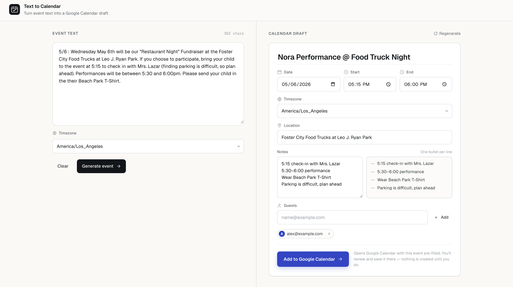

# Home Page Demo Brief

Create a single-page demo for a tool that converts unstructured event text into a pre-filled Google Calendar event.

This should feel like a real working utility, not a marketing landing page. The first screen should be the product itself.

## Page Purpose

The home page lets a user:

1. Paste event-related text.
2. Generate a structured calendar event draft.
3. Review and edit the extracted event details.
4. Add optional guest emails.
5. Open Google Calendar with the event details pre-filled.

MVP does not require Google OAuth. The primary action opens a Google Calendar event creation page; the user still reviews and saves the event inside Google Calendar.

## Overall Layout

Use a clean, focused two-column desktop layout:

- Left side: raw event text input.
- Right side: extracted event preview/editor.

On mobile, stack sections vertically:

1. Input
2. Generate button
3. Preview/editor
4. Add to Google Calendar button

Keep the UI compact and practical. Avoid a big hero, marketing copy, illustrations, gradients, decorative cards, or unnecessary onboarding.

## Header

Simple top bar:

- Product name: `Text to Calendar`
- Short tagline: `Turn event text into a Google Calendar draft`

No navigation is needed for the demo.

## Input Section

Title: `Event Text`

Large textarea with placeholder:

```text
Paste an email, message, flyer text, or event description...
```

Include sample content in the demo textarea:

```text
5/6 : Wednesday May 6th will be our "Restaurant Night" Fundraiser at the Foster City Food Trucks at Leo J. Ryan Park. If you choose to participate, bring your child to the event at 5:15 to check in with Mrs. Lazar (finding parking is difficult, so plan ahead). Performances will be between 5:30 and 6:00pm. Please send your child in the their Beach Park T-Shirt.
```

Controls below the textarea:

- Primary button: `Generate Event`
- Secondary text/button: `Clear`

Optional context row:

- Timezone selector or text field, prefilled with `America/Los_Angeles`

## Preview Section

Title: `Calendar Draft`

Show editable fields after generation. For the demo, show the generated state by default.

Fields:

- Title
- Date
- Start time
- End time
- Timezone
- Location
- Notes
- Guests

Demo values:

```text
Title: Nora Performance @ Food Truck Night
Date: May 6
Start time: 5:15 PM
End time: 6:00 PM
Timezone: America/Los_Angeles
Location: Foster City Food Trucks at Leo J. Ryan Park
```

Notes field:

```text
5:15 check-in with Mrs. Lazar
5:30-6:00 performance
Wear Beach Park T-Shirt
Parking is difficult, plan ahead
```

Guests field:

- A text input with placeholder `name@example.com`
- A small `Add` button
- Show one sample guest chip, such as `alex@example.com`

Primary action:

- Button: `Add to Google Calendar`
- Supporting note near the button: `Opens Google Calendar with this event pre-filled. You will review and save it there.`

## Required Field State

Start time is the only field that must be filled before opening Google Calendar.

For the demo, include a subtle validation example near the start time field, but do not show it as an active error in the default state. The design should support this message:

```text
Start time is required to create a useful calendar event.
```

## Defaults To Communicate In UI

The UI does not need a long explanation, but the preview should make these defaults feel understandable:

- If year or month is missing, the app chooses the nearest reasonable upcoming date.
- If end time or duration is missing, the app defaults to 1 hour.
- All fields remain editable before opening Google Calendar.

These can appear as small helper text in the preview area, not as a large instruction block.

## Interaction States To Represent

The demo can be static, but it should visually account for these states:

- Empty input validation.
- Loading state after clicking `Generate Event`.
- Generated preview state.
- Missing start time validation.
- Invalid guest email validation.

Only the generated preview state needs to be visible by default.

## Visual Direction

Use a calm productivity-tool aesthetic:

- White or near-white background.
- Subtle borders.
- Clear form labels.
- Compact spacing.
- Professional typography.
- Minimal color, with Google Calendar action using a clear primary button style.

Avoid:

- Marketing landing-page layout.
- Large hero section.
- Decorative illustrations.
- Heavy gradients.
- Nested cards.
- Overly playful styling.

## Demo Behavior

For demo HTML, it is acceptable to simulate generation:

- Clicking `Generate Event` can populate the preview with the demo values.
- Clicking `Add to Google Calendar` can open a placeholder Google Calendar URL or show a mock status.

The page should make it clear that the real MVP opens Google Calendar, and the user saves the event there.


