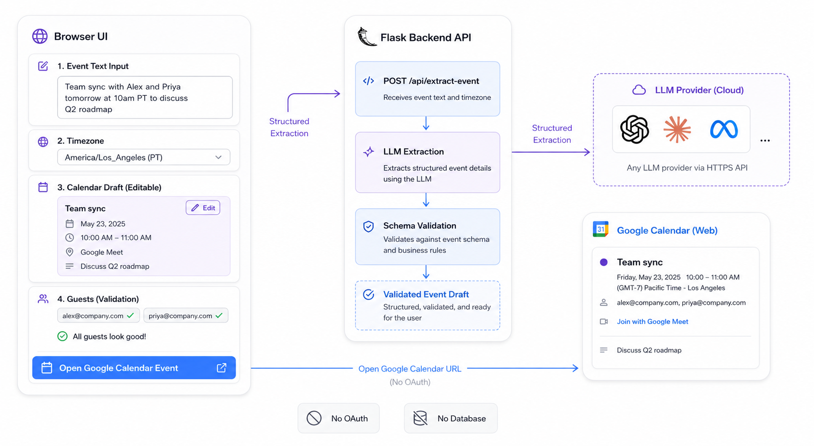
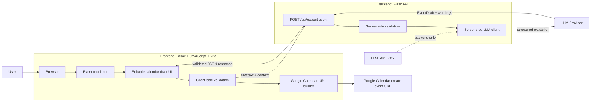
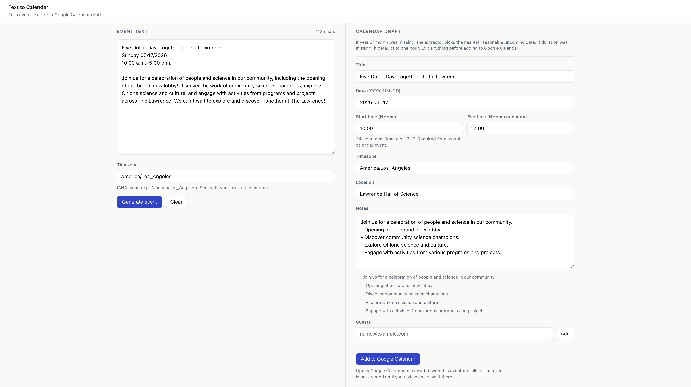
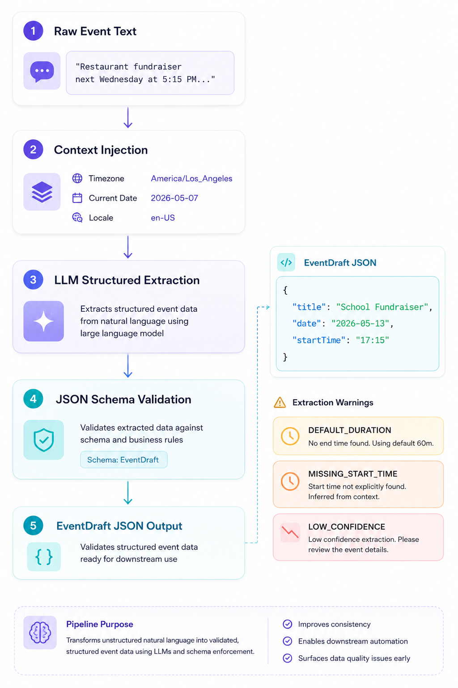
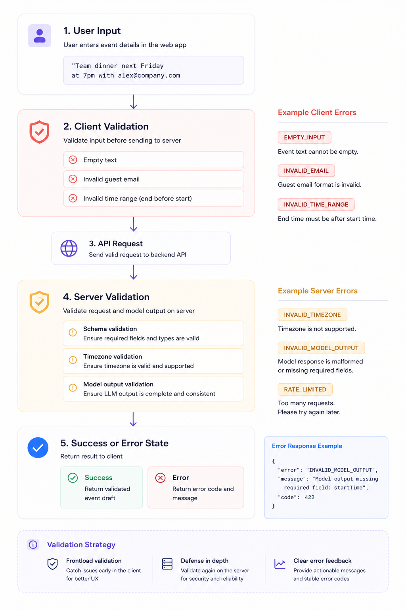
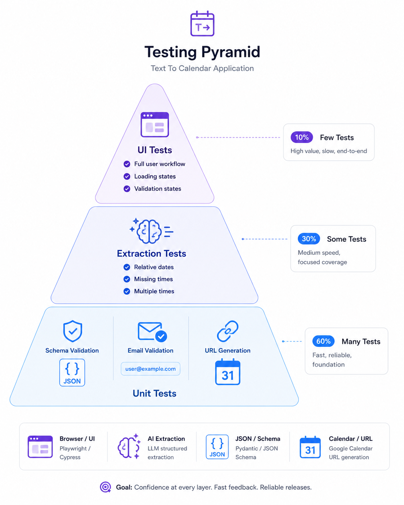

# Text To Calendar Technical Design

## 1. Overview


Text to Calendar is a single-page web app that converts unstructured event text into an editable calendar draft, then opens Google Calendar with the event pre-filled.

The MVP should stay intentionally small:

- A browser UI based on the demo in `docs/demo/calendar tool`.
- One backend extraction endpoint.
- LLM structured output for event details.
- Client-side validation and Google Calendar URL generation.
- No accounts, no database, no Google OAuth, and no direct calendar writes.

## 2. High-Level Architecture




```text
Browser
  - Event text input
  - Timezone/context controls
  - Editable event draft
  - Guest email validation
  - Google Calendar URL builder

Flask Backend API
  - POST /api/extract-event
  - Calls LLM with raw text, timezone, current date, and locale context
  - Validates/parses structured model output
  - Returns an EventDraft JSON response

External Services
  - LLM provider for extraction
  - Google Calendar web create-event URL
```



## 3. MVP Technology Shape

A small split web app is the target shape: a Node.js frontend for the browser UI and a Flask backend for extraction. This keeps the LLM/API-key boundary explicit while still supporting a simple one-page product.

Suggested stack:

- Frontend: React + JavaScript + Vite, with `package.json` set to `"type": "module"`.
- Backend: Flask API.
- Styling: plain CSS, CSS modules, or a lightweight component approach matching the demo.
- LLM: server-side Python SDK call only.
- Validation: a canonical JSON event draft contract shared through documentation and mirrored by frontend JavaScript helpers and backend Python validation.
- Deployment: any platform that can host a static or Node-served frontend plus a Flask API.

The API key must never be exposed to the browser.

## 4. Frontend Design



The demo already establishes the main UI contract:

- Sticky compact header with product name.
- Two-column desktop layout:
  - Left: raw event text input and timezone.
  - Right: editable calendar draft.
- Stacked mobile layout.
- Generated draft visible after extraction.
- Clear loading, empty, defaulted-start-time, and invalid-guest-email states.

Primary frontend state:

```js
const ExtractionState = {
  IDLE: "idle",
  LOADING: "loading",
  GENERATED: "generated",
  ERROR: "error",
};
```

The frontend owns:

- Raw event text.
- Selected timezone.
- Editable event draft after extraction.
- Guest input/chips.
- Validation messages.
- Google Calendar URL creation.

The frontend should allow the user to edit every extracted field before opening Google Calendar.

## 5. Backend API

### `POST /api/extract-event`

Request:

```text
{
  text: string,
  timezone: string,
  currentDate: string, // ISO date from the user's context, e.g. "2026-05-08"
  locale?: string, // default "en-US"
}
```

Response:

```text
{
  draft: EventDraft,
  warnings: ExtractionWarning[],
}
```

Errors:

```text
{
  error: {
    code:
      | "EMPTY_INPUT"
      | "LLM_EXTRACTION_FAILED"
      | "INVALID_MODEL_OUTPUT"
      | "RATE_LIMITED"
      | "UNKNOWN",
    message: string,
  },
}
```

The backend should reject empty input before calling the LLM.

## 6. Event Draft Schema

The app should use one canonical event draft shape between API and UI.

```text
{
  title: string,
  date: string, // YYYY-MM-DD
  startTime: string | null, // HH:mm, 24-hour local time
  endTime: string | null, // HH:mm, 24-hour local time
  timezone: string, // IANA timezone
  location: string,
  notes: string,
  guests: string[],
  missingStartTime: boolean,
}
```

Potential warnings:

```text
{
  field: keyof EventDraft | "general",
  code:
    | "INFERRED_DATE"
    | "DEFAULT_START_TIME"
    | "DEFAULT_DURATION"
    | "MISSING_START_TIME"
    | "LOW_CONFIDENCE"
    | "MULTIPLE_POSSIBLE_TIMES",
  message: string,
}
```

Warnings let the UI explain defaults without making the draft feel blocked.

## 7. LLM Extraction Design



The LLM should return structured data, not prose.

Inputs to the model:

- Raw pasted event text.
- User timezone.
- Current date.
- Locale.
- Extraction rules from the PRD.

Model rules:

- Prefer facts explicitly present in the source text.
- Generate a concise, useful title.
- Preserve attendance instructions, reminders, caveats, and logistics in notes.
- If month/year is missing, choose the nearest reasonable upcoming date.
- If duration/end time is missing, default to one hour and emit `DEFAULT_DURATION`.
- If start time is missing or unclear, default to `startTime: "10:00"`, set `missingStartTime: false`, and emit `DEFAULT_START_TIME`.
- If multiple times are present, choose the time that best represents when the user should arrive or attend, and preserve other times in notes.

The server should validate model output before returning it to the browser.

## 8. Google Calendar URL Generation

MVP uses Google Calendar's web event creation URL instead of Calendar API OAuth.

The URL builder should map:

- `title` to event text/title.
- `date`, `startTime`, `endTime`, and `timezone` to the event date range.
- `location` to location.
- `notes` to details.
- `guests` to the guest parameter if supported.

The frontend should allow Google Calendar opening when the backend provides the
default `10:00` start time, while making the default easy to review and edit.

If guest prefill is unreliable, the fallback is to include guest emails in notes and let the user add them manually in Google Calendar.

## 9. Validation



Client-side validation:

- Raw text is required before extraction.
- Start time is required before opening Google Calendar; missing source times
  should arrive from the API as the editable `10:00` default.
- Guest emails must be valid before adding them to the draft.
- End time should be after start time when both are present.
- Date must be present before opening Google Calendar.

Server-side validation:

- Raw text is required.
- Timezone should be a valid IANA timezone.
- Model output must match the event draft schema.

## 10. Privacy And Logging

The MVP should not store raw pasted text.

Logging should avoid user-sensitive content:

- Do not log raw event text by default.
- Do not log guest emails.
- Log request outcome, latency, error code, and coarse model usage if needed.
- If debugging logs are added later, they should be explicitly enabled and redacted where practical.

## 11. Testing Plan



Core unit tests:

- Event draft schema validation.
- Empty input handling.
- Guest email validation.
- Google Calendar URL generation.
- Date/time formatting around timezone inputs.

Extraction tests:

- PRD sample input.
- Missing end time defaults to one hour.
- Missing start time defaults to 10:00 AM and still allows calendar creation after validation.
- Relative dates like "tomorrow" or "next Wednesday".
- Multiple times such as arrival/check-in/performance.

UI tests:

- User can paste text, generate a draft, edit fields, add a guest, and open the calendar URL.
- Empty input shows validation.
- Invalid guest email shows validation.
- Defaulted start time is shown and can be used to open Google Calendar.

## 12. Future Extensions

These should stay outside MVP:

- Google OAuth and direct Calendar API insertion.
- Apple Calendar or `.ics` export.
- Multi-event newsletter extraction.
- Saved history.
- User accounts.
- Inbox import.
- Remembered guest lists.

## 13. Open Questions

- Which LLM provider/model should be used for MVP?
- Should the frontend build the Google Calendar URL, or should the backend return it after validation?
- Do Google Calendar create-event links support guest prefill reliably enough for MVP?
- Should notes remain plain text, or should the UI store them as an array of bullet lines?
- How strict should the app be when the end time is earlier than the start time?
