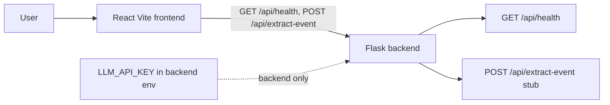

# Frontend And Flask Backend Scaffold

## Ticket

### Title

Create the MVP frontend and Flask backend scaffold.

### Type

Chore

### Overview

The project currently contains product, technical, and demo documentation, but no runnable application scaffold. The MVP needs a small React + JavaScript + Vite frontend with one page and a Flask backend with one server-side extraction endpoint.

This ticket establishes the application foundation so later tickets can add extraction, editing, validation, and Google Calendar behavior without deciding the project shape repeatedly.

### Goal

Create a runnable split app structure: a React + JavaScript + Vite frontend that hosts the single-page tool, plus a Flask backend that hosts health checks, environment loading, and the extraction API route.

### Description

Set up the frontend with React, JavaScript, Vite, `"type": "module"`, a basic styling approach, and linting or formatting defaults. Set up the backend with Flask, a health check or minimal app entrypoint, a backend dependency file, local environment loading, and environment variable support for the LLM API key. The scaffold should keep the API key backend-only and should not introduce accounts, databases, Google OAuth, or direct calendar writes.

The first screen should be reserved for the actual text-to-calendar tool rather than a marketing page. The scaffold can start with placeholder UI, but it should be ready for the demo-inspired layout in later tickets.

### Notes

- Source docs: `docs/prd/prd.md`, `docs/tech/tech_design.md`.
- Suggested stack from tech design: React, JavaScript, Vite, `"type": "module"`, Flask backend, runtime validation, server-side Python LLM SDK call.
- The demo in `docs/demo/calendar tool` is a visual and interaction reference.
- Backend scaffold should live in `backend/`; frontend scaffold should live in `frontend/`.

## Plan

### Execution Plan

Create a runnable split frontend/backend scaffold that matches `docs/prd/prd.md`
and `docs/tech/tech_design.md`. Keep the scope to project shape, dev scripts,
placeholder tool UI, health check, environment loading, and a stub extraction
route. Real LLM extraction, shared schema validators, Google Calendar URL
generation, guest validation, and full UI behavior are deferred to later
tickets (002, 003, 004, 005, 006).

Decisions:

- Use `npm` for the frontend (no existing lockfile in the repo).
- Use plain CSS, keeping the demo direction in `docs/demo/calendar tool` as a
  visual reference without copying behavior.
- Use `requirements.txt` plus `python-dotenv` for backend dependencies and
  local `.env` loading.
- Add a backend-only `.env.example` documenting `LLM_API_KEY`; do not expose
  any API key through Vite env vars.
- Scaffold `POST /api/extract-event` to validate empty input (`400
  EMPTY_INPUT`) and otherwise return `501 NOT_IMPLEMENTED`, leaving real
  extraction to ticket 003.
- Vite dev server proxies `/api/*` to `http://127.0.0.1:5000` so the frontend
  and backend can run side-by-side without CORS in development.

### Steps

1. Create `frontend/` with `package.json` (`"type": "module"`), Vite + React
   entry files, a placeholder two-column tool UI, plain CSS, and Prettier
   defaults.
2. Create `backend/` with a Flask `app.py`, `requirements.txt`,
   `.env.example`, `.gitignore`, and a `README.md` covering setup and run.
3. Update root `.gitignore` for Python/Vite artifacts and update `CLAUDE.md`
   with concrete commands for both apps.
4. Verify: `npm run build` in `frontend/` and import + live-route checks for
   the Flask backend.

### Files To Touch

- `frontend/package.json`, `frontend/index.html`, `frontend/vite.config.js`,
  `frontend/src/main.jsx`, `frontend/src/App.jsx`, `frontend/src/styles.css`,
  `frontend/.gitignore`, `frontend/.prettierrc`, `frontend/README.md`
- `backend/app.py`, `backend/requirements.txt`, `backend/.env.example`,
  `backend/.gitignore`, `backend/README.md`
- `.gitignore`, `CLAUDE.md`

## Execution

### Execution Summary

- Frontend scaffold created under `frontend/`: React 19 + Vite 8 with
  `"type": "module"`, a placeholder two-column tool UI (event text input on
  the left, preview placeholder on the right), plain CSS, Prettier defaults,
  and a Vite dev proxy from `/api` to `http://127.0.0.1:5000`.
- Backend scaffold created under `backend/`: Flask app exposing
  `GET /api/health` and a `POST /api/extract-event` stub. The stub returns
  `400 EMPTY_INPUT` for missing text and `501 NOT_IMPLEMENTED` otherwise.
  `python-dotenv` loads `.env`, and `LLM_API_KEY` stays backend-only via
  `.env.example`.
- Repo hygiene: root `.gitignore` extended for Python venvs, `__pycache__`,
  build output, and `.env`; `CLAUDE.md` updated with concrete dev commands
  for both apps.

### Commits

- _Pending user request to commit._

### Notes

Verification performed:

- `cd frontend && npm install` — installed React 19, Vite 8, Prettier.
- `cd frontend && npm run build` — built cleanly (`dist/` produced, no
  warnings beyond chunk sizes).
- `cd backend && python3 -m venv .venv && pip install -r requirements.txt &&
  python -c "import app"` — imports succeed.
- Ran `python app.py` and exercised endpoints with `curl`:
  - `GET /api/health` → `200 {"status":"ok"}`.
  - `POST /api/extract-event` with `{}` → `400 EMPTY_INPUT`.
  - `POST /api/extract-event` with `{"text":"hello"}` → `501 NOT_IMPLEMENTED`.

Deferred to later tickets:

- Shared `EventDraft` schema and validators (ticket 002).
- Real LLM-backed extraction in `POST /api/extract-event` (ticket 003).
- Full tool UI, editable preview, and interactions (ticket 004).
- Google Calendar URL generation (ticket 005).
- Client validation polish (ticket 006).
- Privacy/logging behavior (ticket 007).
- MVP test suite (ticket 008).
