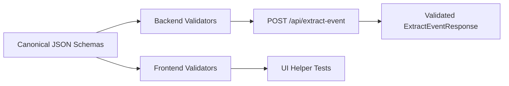

# Event Draft Schema

## Ticket

### Title

Define shared event draft schemas and validation.

### Type

Feature

### Overview

The frontend and backend need one canonical event draft shape so extracted data, editable UI state, warnings, validation, and Google Calendar URL generation all speak the same language.

This ticket turns the schema from the technical design into a canonical JSON contract plus runtime validators.

### Goal

Create shared request, response, draft, warning, and error schemas for the extraction workflow.

### Description

Define `EventDraft`, `ExtractionWarning`, `ExtractEventRequest`, `ExtractEventResponse`, and `ExtractEventError` as JSON schemas or equivalent shared contract files. Add runtime validation for API input and model output, including date format, local time format, guest array shape, `missingStartTime`, and warning codes.

The schema should support these draft fields: title, date, start time, end time, timezone, location, notes, guests, and missing-start-time status. It should also support extraction warnings for inferred dates, default duration, missing start time, low confidence, and multiple possible times.

### Notes

- Source docs: `docs/tech/tech_design.md` sections 5 and 6.
- Runtime validation should be usable from both API tests and UI helper tests.
- Do not store raw pasted text as part of the event draft.

## Plan

### Execution Plan

Define a canonical JSON Schema bundle under `shared/schemas/` as the single source of truth for `EventDraft`, `ExtractionWarning`, `ExtractEventRequest`, `ExtractEventResponse`, and `ExtractEventError`. Add runtime validation with `jsonschema` (backend) and `ajv` (frontend), plus semantic checks for `missingStartTime` vs `startTime`. Keep raw text only on the request object, never on `EventDraft`. Wire `POST /api/extract-event` to validate the request body after the empty-text check; defer LLM and response shaping to ticket 003.

### Questions

_No open questions; strategy is canonical JSON Schema plus `jsonschema` and `ajv`._

### Steps

1. Add `shared/schemas/extraction.schemas.json` with `$defs` for all contract types and internal `$ref` links.
2. Implement `backend/validators.py` to load the bundle, validate by `$def`, and enforce draft semantics (`missingStartTime` iff `startTime` is null).
3. Add `jsonschema` and `pytest` to backend dependencies; add `backend/tests/` for schema and semantic cases.
4. Add `ajv` and `vitest` to the frontend; implement `frontend/src/validation/extraction.js` mirroring backend behavior.
5. Add `frontend/src/validation/extraction.test.js` with the same fixtures as backend where practical.
6. Update `POST /api/extract-event` to return `400` with `INVALID_REQUEST` when the request body fails schema validation (after `EMPTY_INPUT`).
7. Run `pytest`, `npm test`, and `npm run build` to verify.

### Files To Touch

- `shared/schemas/extraction.schemas.json`
- `backend/requirements.txt`, `backend/validators.py`, `backend/app.py`
- `backend/tests/test_extraction_schemas.py`
- `frontend/package.json`, `frontend/package-lock.json`, `frontend/vite.config.js`
- `frontend/src/validation/extraction.js`, `frontend/src/validation/extraction.test.js`

## Execution

### Execution Summary

- Added canonical bundle [shared/schemas/extraction.schemas.json](shared/schemas/extraction.schemas.json) (`$defs` for `EventDraft`, `ExtractionWarning`, `ExtractEventRequest`, `ExtractEventResponse`, `ExtractEventError`) including `INVALID_REQUEST` on errors for request validation.
- Backend: [backend/validators.py](backend/validators.py) (`jsonschema` + `referencing`), [backend/pytest.ini](backend/pytest.ini), and [backend/tests/test_extraction_schemas.py](backend/tests/test_extraction_schemas.py). `POST /api/extract-event` validates the request after `EMPTY_INPUT` ([backend/app.py](backend/app.py)).
- Frontend: [frontend/src/validation/extraction.js](frontend/src/validation/extraction.js) (`ajv`), Vitest in [frontend/vite.config.js](frontend/vite.config.js), tests in [frontend/src/validation/extraction.test.js](frontend/src/validation/extraction.test.js).
- Docs: [CLAUDE.md](CLAUDE.md) and [backend/README.md](backend/README.md) updated with test commands.

### Commits

- _Pending user request to commit._

### Notes

Verification: `pytest` (17 passed), `npm test` (13 passed), `npm run build` (success).

