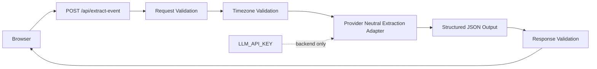

# Flask Extract Event API

## Ticket

### Title

Implement the Flask event extraction API.

### Type

Feature

### Overview

The product depends on an LLM to convert pasted event text into a structured calendar draft. The browser must not call the LLM directly because the API key must remain on the Flask backend.

This ticket implements the Flask `POST /api/extract-event` route and connects it to structured model output.

### Goal

Return a validated `EventDraft` and extraction warnings from raw user text, timezone, current date, and locale context through the Flask backend.

### Description

Implement the Flask backend route described in the technical design. The route should reject empty input before calling the LLM, validate timezone input, call the configured Python LLM client with extraction rules from the PRD, validate structured model output, and return consistent error codes.

The prompt or model instructions should prefer explicit facts, create a concise title, preserve logistics in notes, infer nearest reasonable upcoming dates when month or year is missing, default missing durations to one hour, and mark missing start time as blocking.

### Notes

- Source docs: `docs/prd/prd.md` section 7.2 and `docs/tech/tech_design.md` sections 5 and 7.
- Backend implementation should live under `backend/`.
- The endpoint must not log raw event text or guest emails.
- MVP should not require Google OAuth or direct calendar writes.

## Plan

### Scope

Turn the existing `501 NOT_IMPLEMENTED` route in `backend/app.py` into a real extraction pipeline while preserving the shared schema contract from `shared/schemas/extraction.schemas.json`.

### Key Decisions

- Use a provider-neutral backend adapter for model extraction in ticket 003. The route depends on an internal function/interface that returns structured JSON; a concrete OpenAI/Anthropic SDK can be added later without changing route validation or API tests.
- Keep `LLM_API_KEY` backend-only and never pass it to frontend code or logs.
- Preserve the ticket 002 validation layer: request validation happens before extraction, model output is validated as `ExtractEventResponse`, and invalid model output returns `INVALID_MODEL_OUTPUT`.
- Do not store or log raw pasted event text or guest emails. Log only coarse route outcomes if logging is introduced.
- Keep Google Calendar URL generation, frontend UX wiring, and client validation outside this ticket.

### Implementation Steps

1. Add backend extraction module boundaries (`backend/extraction.py`) with a provider-neutral `extract_event_from_text(payload)` function and small helpers for prompt construction and output normalization.
2. Define model instructions from `docs/prd/prd.md` section 7.2 and `docs/tech/tech_design.md` section 7: prefer explicit facts, create concise title, preserve logistics in notes, infer nearest upcoming dates, default missing duration to one hour, and mark missing start time as blocking.
3. Update `backend/app.py` so `POST /api/extract-event` follows this order: parse JSON, reject empty text with `EMPTY_INPUT`, validate schema with `INVALID_REQUEST`, validate IANA timezone, call the extraction adapter, validate the returned `ExtractEventResponse`, then return `200`.
4. Add error mapping in the route: adapter extraction failure returns `LLM_EXTRACTION_FAILED`, malformed adapter/model output returns `INVALID_MODEL_OUTPUT`, rate-limit style failures return `RATE_LIMITED` if the adapter exposes that condition, and unexpected failures return `UNKNOWN` without leaking raw input.
5. Add focused backend tests in `backend/tests/` using monkeypatched/fake extraction adapters so tests do not call a real LLM. Cover success, empty input, invalid request, invalid timezone, adapter failure, invalid model output, missing-start-time response, and no sensitive data in error bodies.
6. Update backend dependency/config docs only if needed. Python's standard `zoneinfo` can validate IANA timezones, so no new dependency is expected for timezone validation.
7. After implementation, fill `## Execution` with what changed, tests run, and commit status.

### Files Likely Touched

- `docs/tickets/003-extract-event-api.md`
- `backend/app.py`
- `backend/extraction.py`
- `backend/validators.py`, only if response validation helpers need ergonomic additions
- `backend/tests/test_extract_event_api.py`
- `backend/README.md`, only if the adapter/env behavior needs documenting

### Verification

- Run `cd backend && pytest` and confirm schema plus API route tests pass.
- Confirm success-path tests validate the exact response shape against `ExtractEventResponse`.
- Confirm failure-path tests return stable error codes and do not include raw text or guest emails.
- Confirm the Flask app imports cleanly with no real LLM call required during tests.

### Questions

_No unresolved questions. Provider strategy is a provider-neutral adapter for ticket 003._

## Execution

### Execution Summary

- Added [`backend/extraction.py`](../../backend/extraction.py): `ExtractionError`, `SYSTEM_INSTRUCTIONS`, optional stdlib OpenAI-compatible `chat/completions` call when `LLM_API_KEY` is set, `_normalize_response` (draft `timezone` matches request), and `get_extract_event_fn` for `app.config["EXTRACT_EVENT_FN"]` injection in tests.
- Updated [`backend/app.py`](../../backend/app.py): `POST /api/extract-event` validates request JSON schema, validates IANA `timezone` via `zoneinfo`, calls the extractor, validates `ExtractEventResponse`, returns `200` or mapped errors (`INVALID_REQUEST`, `LLM_EXTRACTION_FAILED` / `502`, `INVALID_MODEL_OUTPUT` / `502`, `RATE_LIMITED` / `429`, `UNKNOWN` / `500`).
- Added [`backend/tests/test_extract_event_api.py`](../../backend/tests/test_extract_event_api.py); removed route tests from [`backend/tests/test_extraction_schemas.py`](../../backend/tests/test_extraction_schemas.py).
- Updated [`backend/README.md`](../../backend/README.md) and [`backend/.env.example`](../../backend/.env.example) for LLM env vars.

### Verification

- `cd backend && python3 -m venv .venv && .venv/bin/pip install -r requirements.txt && .venv/bin/pytest -q` → **25 passed**.

### Commits

- `[003] Add Flask extract-event API, shared schemas, and app scaffold` (latest on `main`).
