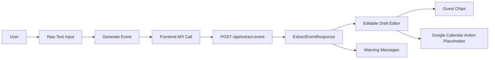

# Tool UI

## Ticket

### Title

Build the single-page text-to-calendar UI.

### Type

Feature

### Overview

The MVP should open directly to the tool: raw event text input, timezone or context controls, editable event preview, guest entry, and a Google Calendar action. The demo already establishes the broad layout and state expectations.

This ticket builds the main user experience without requiring direct Google Calendar behavior to be complete.

### Goal

Create a responsive single-page interface where users can paste event text, generate a draft, edit all draft fields, and manage guest emails.

### Description

Implement the frontend state machine with `idle`, `loading`, `generated`, and `error` states. The page should include a large raw text area, timezone selection or display, generate button, editable preview fields, notes editing, guest email input with chips or list behavior, warning display, and loading and error states.

The layout should follow the demo and technical design: compact header, two-column desktop layout, stacked mobile layout, input on the left, draft editor on the right. Empty input should show a clear validation message before the API is called.

### Notes

- Source docs: `docs/prd/prd.md` sections 6, 7.1, 7.3, 7.4, and 8.
- Source docs: `docs/tech/tech_design.md` section 4.
- Every extracted field must be editable before opening Google Calendar.

## Plan

## Scope

Build the frontend experience described in the **Ticket** section above: a responsive two-column tool with raw text input, timezone context, extraction state, editable draft fields, warning display, notes editing, and guest chips. The ticket should call the existing Flask `POST /api/extract-event` API and consume the shared `ExtractEventResponse` contract from [shared/schemas/extraction.schemas.json](shared/schemas/extraction.schemas.json).

Out of scope for this ticket: Google Calendar URL construction/opening, full draft validation rules, backend changes, OAuth, direct calendar writes, and broad UI test coverage. Those remain in tickets 005, 006, and 008.

## Data Flow

## Key Decisions

- Keep implementation mostly in [frontend/src/App.jsx](frontend/src/App.jsx) and [frontend/src/styles.css](frontend/src/styles.css) unless small helper extraction materially improves readability.
- Use the browser timezone from `Intl.DateTimeFormat().resolvedOptions().timeZone`, falling back to `America/Los_Angeles` only when unavailable.
- Send `{ text, timezone, currentDate, locale }` to `/api/extract-event`; validate successful responses with `validateExtractEventResponse` from [frontend/src/validation/extraction.js](frontend/src/validation/extraction.js).
- Represent UI state explicitly as `idle`, `loading`, `generated`, and `error`, matching [docs/tech/tech_design.md](docs/tech/tech_design.md).
- Treat guest email validation as local chip-entry validation only for this ticket. Broader calendar-blocking validation belongs to ticket 006.
- Render an `Add to Google Calendar` button as disabled or non-opening explanatory UI until ticket 005 adds the URL builder.

## Implementation Steps

1. Replace scaffold state in [frontend/src/App.jsx](frontend/src/App.jsx) with explicit state for raw text, timezone, extraction status, draft, warnings, API error, input validation message, and guest input.
2. Add an extraction submit path that trims empty input before the API call, builds the request with current date and locale, handles backend error responses, validates successful JSON, and stores `draft` plus `warnings` in editable state.
3. Build preview states: empty prompt before generation, loading panel during generation, error panel with retry guidance, and generated editable draft after success.
4. Implement editable fields for `title`, `date`, `startTime`, `endTime`, `timezone`, `location`, and `notes`, preserving the schema field names (`startTime`, not demo-only `start`).
5. Implement guest chip entry: add valid trimmed emails, ignore duplicates, remove chips, and show a focused inline error for invalid addresses.
6. Render extraction warnings near relevant draft content using returned warning messages, with special visibility for missing start time.
7. Refresh [frontend/src/styles.css](frontend/src/styles.css) to match the demo direction: compact sticky header, desktop two-column layout, mobile stacked layout, clear form fields, helper text, warning/error treatments, chips, and loading state.
8. Update [docs/tickets/004-tool-ui.md](docs/tickets/004-tool-ui.md) by pasting this plan into `## Plan` per [docs/workflow.md](docs/workflow.md) before implementation begins.

## Verification

- Run `cd frontend && npm test` to ensure shared validation tests still pass.
- Run `cd frontend && npm run build` to catch React/Vite build issues.
- Manually verify empty input does not call the API and shows a clear message.
- With the backend running, manually verify a successful extraction populates an editable draft and warnings.
- Manually verify API failure shows a recoverable error without clearing the user's raw text.
- Manually verify guest chip add/remove and invalid email messaging.
- Manually verify mobile layout stacks input, actions, preview, and calendar placeholder in a usable order.

### Questions

_No unresolved questions. The ticket text already states that this UI work should not require Google Calendar behavior to be complete._

## Execution

### Execution Summary

- Filled `## Plan` with the agreed ticket 004 implementation plan (scope, flow, decisions, steps, verification, questions).
- Replaced scaffold [frontend/src/App.jsx](frontend/src/App.jsx) with extraction UI: `idle` / `loading` / `generated` / `error`, `POST /api/extract-event` with `validateExtractEventResponse` / `validateExtractEventError`, browser default timezone + IANA field with datalist, local `currentDate` + `locale`, empty-input guard, error panel without clearing pasted text, persisted draft when regeneration fails after a success, full editable `EventDraft` fields, warnings list, notes + bullet preview, guest chips with email validation, disabled Google Calendar CTA until ticket 005.
- Expanded [frontend/src/styles.css](frontend/src/styles.css) for two-column / stacked layout, forms, loading, errors, warnings, chips, and calendar action area.

### Verification

- `cd frontend && npm test` — 13 passed.
- `cd frontend && npm run build` — success.

### Commits

- _Pending user request to commit._

