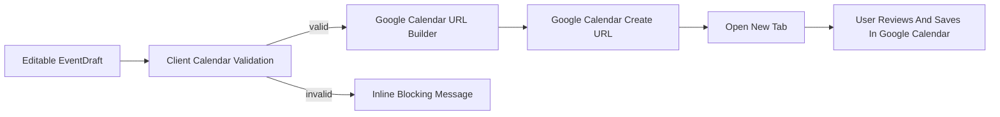

# Google Calendar URL

## Ticket

### Title

Generate and open pre-filled Google Calendar links.

### Type

Feature

### Overview

The MVP adds events through Google Calendar's web create-event URL rather than OAuth or direct Calendar API writes. The app must build a correct URL from the edited draft and block the action when required calendar fields are missing.

This ticket implements the final user-facing action after a draft has been reviewed.

### Goal

Allow users to open Google Calendar with title, date, time, timezone, location, notes, and guest emails pre-filled when possible.

### Description

Create a Google Calendar URL builder that maps the edited draft into the expected query parameters. It should format date/time ranges correctly, include timezone, encode title, location, and notes, and include guests when Google Calendar supports it.

The frontend should block opening Google Calendar when start time or date is missing, when guest emails are invalid, or when end time is not after start time. The UI should clearly communicate that the event is not created until the user saves it in Google Calendar.

### Notes

- Source docs: `docs/prd/prd.md` sections 7.4 and 7.5.
- Source docs: `docs/tech/tech_design.md` section 8.
- If guest prefill is unreliable, include guest emails in notes as a fallback.

## Plan

## Scope

Implement the user-facing Google Calendar action for the existing editable draft UI. This ticket should add a frontend URL builder that converts the edited `EventDraft` into a Google Calendar web create-event URL, validate the draft before opening that URL, and replace the current disabled calendar placeholder with an enabled action when the draft is calendar-ready.

Out of scope for this ticket: Google OAuth, direct Calendar API writes, backend changes, saved history, `.ics` export, and broad end-to-end coverage. Full validation polish can continue in ticket 006, but this ticket must include the blocking checks required before opening Google Calendar.

## Data Flow

## Key Decisions

- Build the URL entirely in the frontend, matching `docs/tech/tech_design.md` section 8 and avoiding new backend surface area.
- Use Google Calendar's web create-event endpoint: `https://calendar.google.com/calendar/render?action=TEMPLATE`.
- Map draft fields to common create-event query params:
  - `title` -> `text`
  - `date`, `startTime`, `endTime` -> `dates`
  - `timezone` -> `ctz`
  - `location` -> `location`
  - `notes` -> `details`
  - `guests` -> `add`
- Format timed events as local wall-clock values without punctuation in the `dates` range: `YYYYMMDDTHHmmss/YYYYMMDDTHHmmss`, paired with `ctz`.
- If `endTime` is empty, default the calendar URL end to one hour after `startTime`, consistent with extraction behavior.
- If guest prefill is unreliable in Google Calendar, still include guests in `add` and append a `Guests: ...` line to `details` as a fallback for manual copying.
- Open Google Calendar in a new tab/window only after validation passes, and keep copy clear that the event is not created until the user saves it in Google Calendar.

## Implementation Steps

1. Add focused calendar URL helpers, preferably outside `App.jsx` if the helper/test surface stays cleaner:
   - Normalize `YYYY-MM-DD`, `HH:mm`, and optional `endTime`.
   - Compute a default one-hour end time when needed.
   - Build query params with `URLSearchParams`.
   - Append guest fallback text to details when guests exist.
2. Add client-side calendar validation before opening:
   - `date` is required.
   - `startTime` is required and `missingStartTime` must not be true.
   - `startTime` and `endTime`, when present, must be valid `HH:mm`.
   - `endTime`, when present, must be after `startTime` for the same event date.
   - guest emails must be valid before opening.
3. Store and render a calendar-action validation message in `App.jsx` without clearing the generated draft.
4. Replace the disabled `Add to Google Calendar` button with an active button that validates the current draft and opens the generated URL with `window.open(url, "_blank", "noopener,noreferrer")`.
5. Update the calendar action copy to state that Google Calendar will open pre-filled and that the user must review and save there.
6. Keep existing guest chip validation, and reuse the same email validator for the final open-blocking check.
7. Add or update frontend unit tests for URL generation and validation edge cases.
8. Update `docs/tickets/005-google-calendar-url.md` execution notes after implementation.

## Verification

- Run `cd frontend && npm test`.
- Run `cd frontend && npm run build`.
- Unit test the generated URL includes title, dates, timezone, location, notes, and guests.
- Unit test missing date and missing start time block URL generation/opening.
- Unit test invalid guest emails block opening.
- Unit test an empty `endTime` produces a one-hour default end time.
- Unit test an `endTime` earlier than or equal to `startTime` blocks opening.
- Manually verify a generated draft opens Google Calendar in a new tab with pre-filled event details.
- Manually verify the UI explains that the event is not saved until the user saves it in Google Calendar.

### Questions

_No unresolved questions. For MVP, the frontend owns URL generation and guest emails are sent through Google Calendar's guest parameter with a notes fallback._

## Execution

### Execution Summary

- Added `frontend/src/calendarUrl.js` with Google Calendar create-event URL generation, draft validation, one-hour default end times, guest query parameters, and guest fallback text in event details.
- Wired `frontend/src/App.jsx` so the Google Calendar button validates the edited draft, opens the pre-filled Google Calendar URL in a new tab, and shows inline blocking errors without clearing the draft.
- Reused the calendar email validator for guest chip entry so guest validation and final open-blocking behavior stay consistent.
- Added `frontend/src/calendarUrl.test.js` coverage for field mapping, date range formatting, one-hour default end time, missing date/start-time blocking, invalid guest blocking, and end-time ordering.

### Verification

- `cd frontend && npm test` — 21 passed.
- `cd frontend && npm run build` — success.

### Commits

- _Pending user request to commit._
