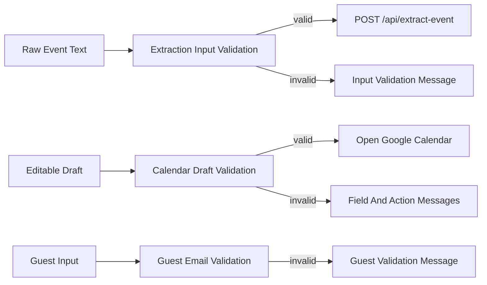

# Client Validation

## Ticket

### Title

Add client-side validation for drafts and guests.

### Type

Feature

### Overview

The app should catch common problems before sending requests or opening Google Calendar. Validation is especially important because the LLM may infer data and because Google Calendar links are less forgiving than a local form.

This ticket focuses on user-correctable validation and clear messages.

### Goal

Prevent empty extraction requests and invalid calendar opens while explaining what the user can do next.

### Description

Add client-side validation for required raw input, required date, required start time before calendar opening, end time after start time, valid timezone, and valid guest email addresses. Invalid guests should be rejected before being added to the draft or before opening Google Calendar.

Missing start time should be clearly indicated because it is required for a useful timed Google Calendar event. Validation messages should be specific and should not erase the user's draft.

### Notes

- Source docs: `docs/prd/prd.md` sections 7.1, 7.3, 7.4, and 9.
- Source docs: `docs/tech/tech_design.md` section 9.
- Server-side validation is handled by the extraction API ticket; this ticket is for browser behavior.

## Plan

## Scope

Refine browser-side validation so user-correctable problems are caught before extraction or before opening Google Calendar, with clear messages that preserve the user's pasted text and edited draft. This ticket should build on the validation introduced in tickets 004 and 005 rather than replacing the schema validation or server-side API validation.

Out of scope for this ticket: backend request validation, LLM output correction, Google Calendar URL generation changes beyond using the same validation surface, direct calendar writes, and broad end-to-end coverage.

## Data Flow

## Key Decisions

- Keep validation in small frontend helpers instead of embedding all validation rules directly in `App.jsx`.
- Reuse and extend the existing `frontend/src/calendarUrl.js` validation where possible so Google Calendar URL generation and UI messages enforce the same rules.
- Treat raw text validation separately from draft validation because raw text blocks extraction, while draft validation blocks only the Google Calendar action.
- Validate timezone with browser-native `Intl.DateTimeFormat(..., { timeZone })` where available, accepting `UTC` and standard IANA timezone names.
- Keep validation user-correctable and specific: say which field needs attention and avoid wiping pasted text, generated drafts, or guest chips.
- Continue rejecting invalid guest emails before adding chips, and also guard against invalid guest data before opening Google Calendar.
- Prefer inline field/action messaging over modal alerts.

## Implementation Steps

1. Audit current validation in `frontend/src/App.jsx` and `frontend/src/calendarUrl.js` to identify duplicated rules and any missing ticket 006 requirements.
2. Add or extend reusable validation helpers:
   - Raw extraction text must be non-empty after trimming.
   - Draft `date` must be present and valid `YYYY-MM-DD`.
   - Draft `startTime` must be present and valid `HH:mm` before opening Google Calendar.
   - Draft `endTime`, when present, must be valid `HH:mm` and after `startTime`.
   - Draft `timezone` must be a valid IANA timezone or `UTC`.
   - Guest emails must match the shared frontend email rule.
3. Update `App.jsx` to render validation messages close to the fields or action they affect:
   - Raw text message below the text area.
   - Missing/invalid date and time messages near the draft fields.
   - Invalid timezone message near the timezone field.
   - Guest email message near guest input/chips.
   - Calendar action summary near the Google Calendar button.
4. Clear stale validation messages when the user edits the relevant field, without clearing unrelated state.
5. Ensure `Generate event` still validates empty raw text before calling the API.
6. Ensure `Add to Google Calendar` blocks on every draft validation error and does not call `window.open` when invalid.
7. Add or update focused unit tests for validation helpers, including timezone validity and field-specific error cases.
8. Update this ticket's execution section after implementation.

## Verification

- Run `cd frontend && npm test`.
- Run `cd frontend && npm run build`.
- Unit test raw text trimming behavior.
- Unit test valid and invalid timezone values.
- Unit test missing/invalid date blocks calendar opening.
- Unit test missing/invalid start time blocks calendar opening.
- Unit test invalid end time and end time before/equal to start time block calendar opening.
- Unit test invalid guest emails are rejected.
- Manually verify validation messages appear beside the relevant input/action.
- Manually verify editing a field clears or updates its stale validation message.
- Manually verify failed validation preserves pasted text and the edited draft.

### Questions

_No unresolved questions. The ticket scope is browser validation only; backend validation remains owned by the extraction API work._

## Execution

### Execution Summary

- Extended `frontend/src/calendarUrl.js` into a shared client-validation surface with raw text validation, IANA timezone validation, field-specific draft errors, and the existing Google Calendar URL checks.
- Updated `frontend/src/App.jsx` to block extraction when raw text or extraction timezone is invalid, block Google Calendar opening on draft validation errors, and show inline messages beside date, start time, end time, timezone, guest input, and the calendar action.
- Added invalid-field styling in `frontend/src/styles.css` so fields with validation errors are visually connected to their messages.
- Expanded `frontend/src/calendarUrl.test.js` coverage for raw text trimming, timezone validation, field-specific draft errors, invalid guests, and end-time ordering.

### Verification

- `cd frontend && npm test` — 26 passed.
- `cd frontend && npm run build` — success.

### Commits

- _Pending user request to commit._
