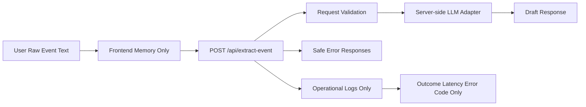

# Privacy And Logging

## Ticket

### Title

Apply MVP privacy and safe logging rules.

### Type

Tech Debt

### Overview

User input may contain names, emails, locations, and private event details. The MVP should avoid storing raw pasted text and should keep logs limited to operational metadata.

This ticket hardens the implementation against accidental sensitive logging.

### Goal

Ensure the app does not store raw event text, expose API keys, or log sensitive event or guest data by default.

### Description

Review server and client behavior for sensitive data handling. The backend should not log raw pasted text or guest emails. Logs, if any, should be limited to request outcome, latency, error code, and coarse model usage. Environment variables should keep LLM credentials server-side only.

Add documentation or comments where useful so future implementation work does not accidentally introduce raw input storage or broad Google permissions.

### Notes

- Source docs: `docs/prd/prd.md` section 10.
- Source docs: `docs/tech/tech_design.md` sections 3 and 10.
- MVP should not request Google Calendar permissions.

## Plan

## Scope

Harden the MVP against accidental sensitive data exposure in logs, errors, documentation, and runtime defaults. This ticket should audit the Flask extraction path, LLM adapter, frontend behavior, and developer docs to ensure raw pasted text, guest emails, event details, and API keys are not stored or logged by default.

Out of scope for this ticket: adding analytics, adding persistent storage, OAuth/direct Google Calendar writes, account-based consent flows, or a full privacy policy. If richer debugging logs are needed later, they should be explicitly opt-in and redacted.

## Data Flow

## Key Decisions

- Keep `LLM_API_KEY` and related LLM credentials server-side only; do not introduce any frontend environment variables for secrets.
- Do not add persistence for raw pasted text, extracted drafts, guest emails, or Google Calendar URLs.
- Avoid logging request bodies, raw model prompts, LLM response contents, guest emails, generated Google Calendar URLs, or exception messages that may contain user data.
- If request logging is introduced, log only operational metadata: endpoint/action, outcome, HTTP status, latency, coarse error code, and optionally model name or broad provider status.
- Preserve current generic error response behavior for unexpected exceptions so sensitive exception text is not sent to the browser.
- Add comments/docs at the backend boundary where future contributors are most likely to add unsafe debug logging.

## Implementation Steps

1. Audit `backend/app.py`, `backend/extraction.py`, backend tests, frontend code, and docs for any logging, printing, raw payload persistence, or accidental exposure of sensitive values.
2. Add a tiny safe logging helper or policy comments in `backend/app.py` only if useful; keep implementation minimal because there is currently no broad logging subsystem.
3. Ensure the extraction route never logs raw request JSON, raw event text, guest emails, model prompt content, model response content, or unknown exception messages.
4. If adding operational logging, include only safe metadata such as route name, status/outcome, error code, and elapsed time.
5. Ensure LLM credentials remain loaded from backend environment variables only and are documented that way in `backend/README.md` or related docs.
6. Add backend regression tests that exercise sensitive input/error paths and assert sensitive text or emails do not appear in API responses or captured logs.
7. Add/update docs or comments warning that debug logging must be opt-in and redacted.
8. Update this ticket's execution section after implementation.

## Verification

- Run backend tests, e.g. `cd backend && python -m pytest`.
- Run frontend checks if frontend code changes, e.g. `cd frontend && npm test` and `cd frontend && npm run build`.
- Unit/regression test that unexpected exceptions do not return raw exception messages containing email-like or secret-like text.
- Unit/regression test that validation or extraction failures do not log raw pasted text or guest emails.
- Manually inspect changed files for `print`, `logger`, request body logging, prompt logging, response logging, and frontend secret exposure.
- Confirm docs state that `LLM_API_KEY` stays server-side and MVP does not request Google Calendar permissions.

### Questions

_No unresolved questions. The MVP should avoid sensitive logging by default; opt-in debugging can be designed later with explicit redaction._

## Execution

### Execution Summary

- Added a backend privacy boundary comment in `backend/app.py` at the extraction route, calling out that raw payloads, event text, prompts, model responses, guest emails, and exception messages must not be logged.
- Replaced direct `ExtractionError.message` responses with safe public messages keyed by error code, reducing the chance that future provider errors echo sensitive event text or emails back to the browser.
- Added backend regression coverage for sensitive strings in expected and unexpected failure paths, asserting they do not appear in API responses or captured logs.
- Documented backend privacy/logging rules in `backend/README.md`, including server-only LLM credentials and metadata-only operational logging.

### Verification

- `cd backend && python -m pytest` — failed because system `python` is not installed in this shell.
- `cd backend && python3 -m pytest` — failed because system Python did not have `jsonschema` installed.
- `cd backend && python3 -m venv .venv && .venv/bin/python -m pip install -r requirements.txt`.
- `cd backend && .venv/bin/python -m pytest` — 27 passed.
- `rg -n "print\\(|logger|logging|app\\.logger|request\\.get_data|request\\.json|traceback|exc_info" backend frontend -S` — no active sensitive logging found; only the new privacy docs/comments matched.

### Commits

- _Pending user request to commit._
