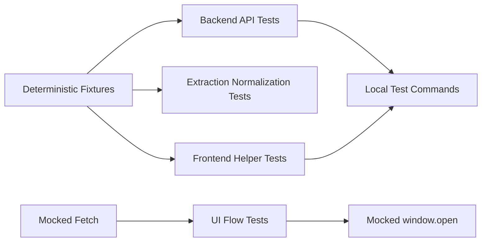

# MVP Test Suite

## Ticket

### Title

Add focused MVP tests for extraction, validation, URLs, and UI flow.

### Type

Feature

### Overview

The technical design calls for unit, extraction, and UI tests around the core user journey. The MVP has a small enough surface that focused tests can protect the important behavior without building a heavy test system.

This ticket adds confidence that the app can create a correct event from realistic pasted text and handle common edge cases.

### Goal

Cover the core MVP behavior with automated tests that can run locally and in CI.

### Description

Add tests for event draft schema validation, Flask API empty input handling, backend timezone validation, guest email validation, Google Calendar URL generation, timezone-aware date/time formatting, and the PRD sample extraction behavior. Add UI tests for paste, generate, edit, guest entry, validation errors, and opening the Google Calendar URL.

Where LLM output would make tests unstable, use mocks or fixtures for the extraction service and keep one or more integration-style tests focused on prompt/output validation rather than live model calls.

### Notes

- Source docs: `docs/tech/tech_design.md` section 11.
- Source docs: `docs/prd/prd.md` sections 3, 9, and 11.
- Include focused Flask backend tests for `POST /api/extract-event`.
- Tests should avoid sending real private event text to external services during normal runs.

## Plan

## Scope

Round out the MVP automated test suite across backend extraction behavior, frontend validation/URL helpers, and the core browser UI flow. This ticket should build on the tests already added in tickets 002, 003, 005, 006, and 007, filling gaps rather than duplicating existing schema, API, URL, validation, and privacy coverage.

Out of scope for this ticket: live LLM calls in normal test runs, real Google Calendar navigation, full cross-browser end-to-end infrastructure, visual regression testing, and CI configuration unless a small script/package change is needed to make local test commands reliable.

## Current Coverage Baseline

- Backend already has schema tests in `backend/tests/test_extraction_schemas.py`.
- Backend already has focused `POST /api/extract-event` route tests in `backend/tests/test_extract_event_api.py`, including empty input, invalid timezone, fake extractor success, extraction errors, invalid model output, and privacy leak checks.
- Frontend already has shared extraction schema validation tests in `frontend/src/validation/extraction.test.js`.
- Frontend already has calendar URL and validation helper tests in `frontend/src/calendarUrl.test.js`, including guests, date/time formatting, default duration, timezone validation, raw text validation, and blocking errors.

## Data Flow

## Key Decisions

- Keep tests deterministic by injecting fake extractor functions and mocked frontend `fetch`/`window.open`.
- Do not call the live LLM or Google Calendar during normal tests.
- Prefer lightweight Vitest/React DOM UI tests for the MVP flow instead of adding a heavy browser test stack, unless the existing frontend setup cannot reasonably test the flow.
- Add fixture-style tests around the PRD sample and edge cases by asserting how the app handles deterministic extractor output, not by asking a live model to infer the event.
- Keep assertions focused on user-visible behavior and contract-critical fields rather than brittle DOM details.
- Preserve existing commands: backend tests through pytest, frontend tests through Vitest, frontend production build through Vite.

## Implementation Steps

1. Audit existing backend and frontend tests and avoid re-testing cases already covered well.
2. Add backend extraction/normalization fixture tests where useful:
   - PRD sample-style successful extraction using an injected fake extractor.
   - Missing end time/default-duration fixture behavior.
   - Missing start time warning fixture behavior.
   - Multiple-times fixture preserving secondary logistics in notes/warnings.
3. Add frontend UI-flow tests around `App.jsx` with mocked `fetch` and mocked `window.open`:
   - Paste text, generate draft, edit fields, add guest, and open Google Calendar URL.
   - Empty input shows validation and does not call the API.
   - Invalid guest email shows validation.
   - Missing start time/date blocks calendar opening.
4. Add any minimal test dependencies/config needed for React DOM testing, such as `jsdom` and Testing Library, only if the current Vitest setup needs them.
5. Ensure UI tests assert Google Calendar opens via mocked `window.open` and inspect the generated URL without leaving the test environment.
6. Update docs or package scripts only if needed to make the local test commands obvious and repeatable.
7. Update this ticket's execution section after implementation.

## Verification

- Run `cd backend && .venv/bin/python -m pytest` when the backend venv exists, or document the fallback setup command if it does not.
- Run `cd frontend && npm test`.
- Run `cd frontend && npm run build`.
- Confirm no test performs a live LLM request.
- Confirm no test opens a real Google Calendar tab.
- Confirm the PRD sample path is covered through deterministic fixtures.
- Confirm UI flow coverage includes paste/generate/edit/guest/open and validation errors.

### Questions

_No unresolved questions. The MVP suite should favor deterministic fixture and mock-driven tests over live external-service tests._

## Execution

### Execution Summary

- Added backend fixture coverage in `backend/tests/test_extract_event_api.py` for the PRD sample-style extraction path, default one-hour duration behavior, and multiple-times logistics/warning behavior using injected fake extractors.
- Added a lightweight React UI-flow suite in `frontend/src/App.test.jsx` with mocked `fetch` and `window.open` covering paste/generate/edit/guest/open, empty input validation, invalid guest validation, and missing-start-time calendar blocking.
- Added frontend DOM test dependencies (`jsdom`, Testing Library React, and Testing Library user-event) and updated `frontend/vite.config.js` so `.test.jsx` files are included.
- Made the React import explicit in `frontend/src/App.jsx` so the component works under the Vitest JSX transform.

### Verification

- `cd frontend && npm install -D @testing-library/react @testing-library/user-event jsdom` initially failed inside the restricted sandbox with `ENOTFOUND`; reran with approved network access and installed successfully.
- `cd backend && .venv/bin/python -m pytest` — 30 passed.
- `cd frontend && npm test` — 30 passed.
- `cd frontend && npm run build` — success.
- Confirmed UI tests use mocked `fetch` and mocked `window.open`; no live LLM or real Google Calendar navigation occurs.

### Commits

- _Pending user request to commit._
