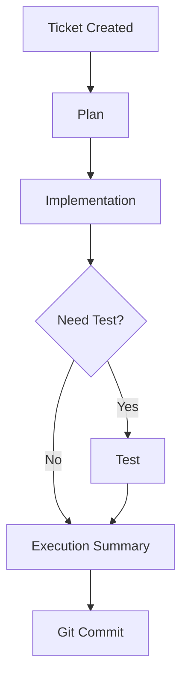
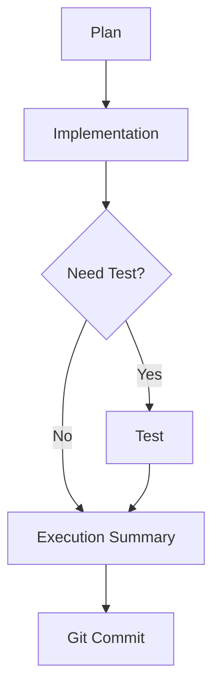
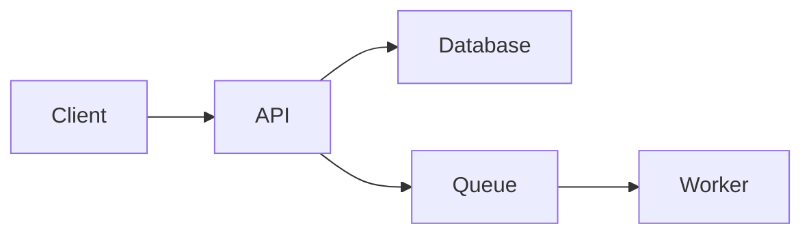
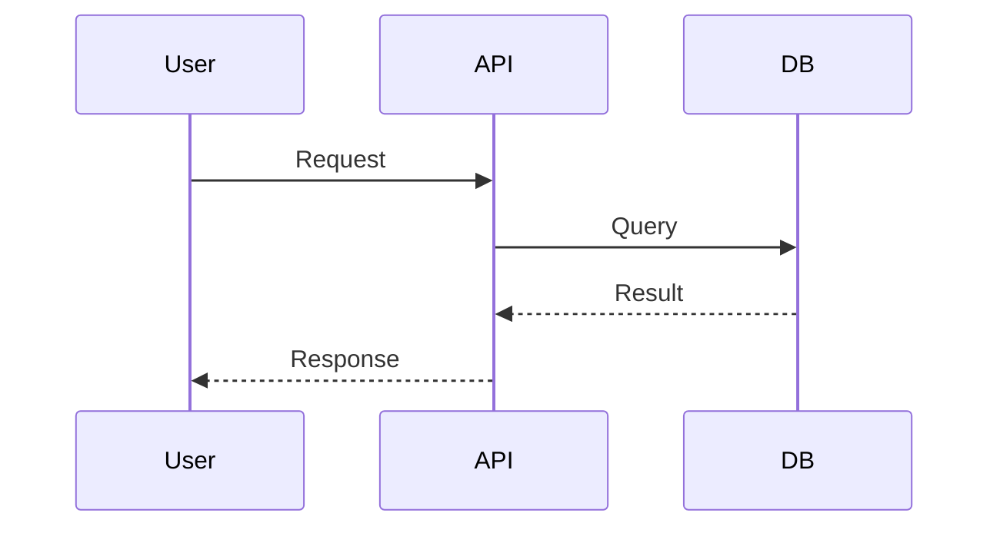

# Development Workflow Specification

## 1. Overview

This project follows a document-driven development workflow.

All project-related documents must be stored under:

```text
project_folder/docs
```

Directory structure:

```text
docs/
├── prd/
├── tech/
└── tickets/
```

---

## 2. Document Organization Rules

### 2.1 PRD Documents

All Product Requirement Documents (PRD) and product-related materials must be placed under:

```text
docs/prd/
```

Examples:

```text
docs/prd/user-auth-prd.md
docs/prd/search-experience-prd.md
docs/prd/memory-system-prd.md
```

### 2.2 Tech Design Documents

All technical design documents must be placed under:

```text
docs/tech/
```

Examples:

```text
docs/tech/auth-architecture.md
docs/tech/vector-search-design.md
docs/tech/event-processing-pipeline.md
```

### 2.3 Ticket Documents

All ticket-related documents must be placed under:

```text
docs/tickets/
```

Each ticket must be maintained as a single markdown file.

Recommended structure:

```text
docs/tickets/
├── TICKET-001-add-user-auth.md
├── TICKET-002-build-search-api.md
└── TICKET-003-improve-error-handling.md
```

Ticket filenames should include both the ticket ID and a short title describing what the ticket is about.

Recommended filename format:

```text
TICKET-XXX-short-ticket-title.md
```

Do not create subfolders for individual tickets unless there is a very strong reason.

---

## 3. Ticket Workflow

Every ticket follows this workflow:

```text
Plan
  ↓
Implementation
  ↓
Test (Optional)
  ↓
Execution Summary
  ↓
Git Commit
```

Recommended Mermaid flow:

````markdown

````

---

## 4. Ticket Lifecycle Requirements

### 4.1 Plan Phase

The `Plan` section must exist inside the ticket markdown file.

Cursor: during the plan phase, take the plan generated from Cursor Plan Mode and insert it into the ticket markdown file under the `Plan` section.

If the generated plan contains unresolved decisions, assumptions, tradeoffs, or unclear requirements, add them under `Plan -> Questions` before implementation starts.

#### Questions Section Requirement

During the ticket planning phase, all important design or implementation questions must be documented under:

```markdown
## Plan

### Questions
```

Each question must include:

* The question
* Multiple options
* Ranking from most recommended to least recommended

Required format:

```markdown
## Plan

### Questions

#### Question 1

Should authentication state be stored in local storage or cookies?

##### Option 1 (Recommended)

Use HTTP-only cookies.

Pros:
- More secure
- Prevents XSS token leakage

Cons:
- Slightly more backend complexity

##### Option 2

Use local storage.

Pros:
- Easy implementation

Cons:
- Vulnerable to XSS

##### Option 3

Use session storage.

Pros:
- Short-lived

Cons:
- Poor persistence
```

### 4.2 Implementation Phase

### 4.3 Test Phase Optional

### 4.4 Execution Summary Phase

The `Execution Summary` section must exist inside the ticket markdown file.

### 4.5 Git Commit Phase

After the execution summary is completed:

* Ensure code is stable
* Ensure documents are updated
* Ensure tests pass, if applicable
* Create a git commit

Recommended commit format:

```text
[TICKET-ID] Short description
```

Example:

```text
[TICKET-021] Add vector search memory indexing
```

---

## 5. Mermaid Diagram Requirement

Generated documents should use Mermaid diagrams whenever Mermaid can improve clarity.

This applies to:

* PRD documents
* Tech design documents
* Ticket documents
* Plans
* Execution summaries
* Architecture docs
* Workflow docs

Do not force Mermaid diagrams when they add no value.

### 5.1 Mermaid Usage Examples

#### Workflow Diagram

````markdown

````

#### Architecture Diagram

````markdown

````

#### Sequence Diagram

````markdown

````

---

## 6. Recommended Ticket Template

```markdown
# Ticket

## Goal

## Scope

## Description

## Plan

Paste the Cursor Plan Mode generated plan here.

### Questions

Add planning questions here when the plan has unresolved decisions, assumptions, tradeoffs, or unclear requirements.

## Implementation

## Test

## Execution Summary

## Git Commit
```

Example location:

```text
docs/tickets/TICKET-001-add-user-auth.md
```

---

## 7. General Documentation Requirements

### 7.1 Keep Documents Concise

Documents should be:

* Easy to scan
* Structured
* Sectioned properly
* Focused on actionable information

Avoid:

* Large unstructured paragraphs
* Repeated information
* Overly verbose explanations

### 7.2 Prefer Structured Sections

Prefer:

* Headers
* Bullet points
* Tables
* Diagrams
* Checklists

Over large prose blocks.

### 7.3 Track Decisions Explicitly

Important decisions should include:

* Context
* Chosen solution
* Alternatives considered
* Reasoning

---

## 8. Core Principles

### 8.1 Documentation First

Important work should begin with documentation.

### 8.2 Plans Before Coding

Do not immediately jump into implementation without a documented plan.

### 8.3 Questions Before Assumptions

Open questions should be documented explicitly during planning.

### 8.4 Execution Transparency

Execution summaries should clearly explain:

* What happened
* What changed
* What remains

### 8.5 Visual Communication Preferred

Prefer diagrams and visual structure whenever possible using Mermaid.
